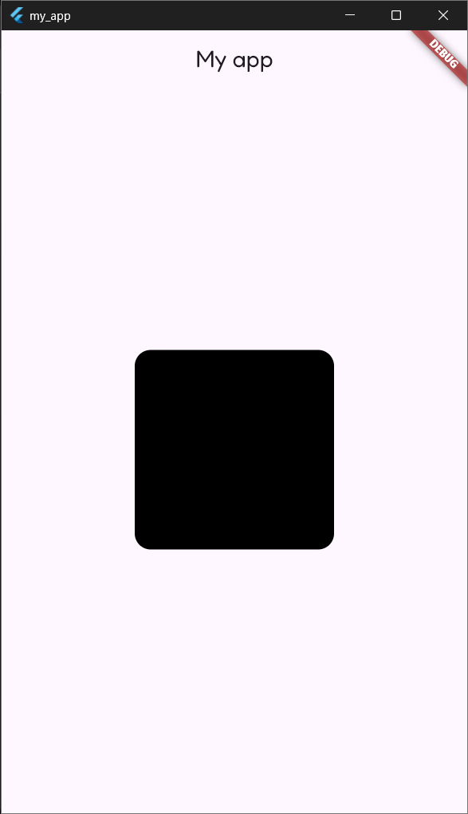
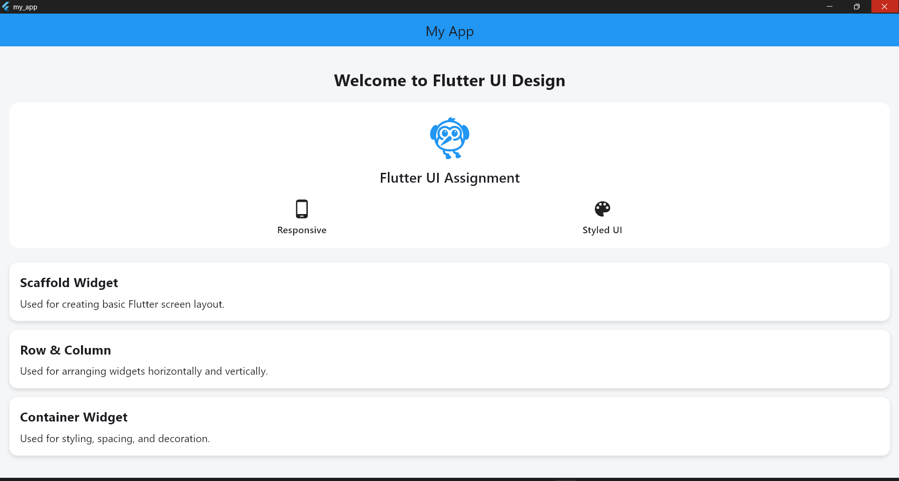
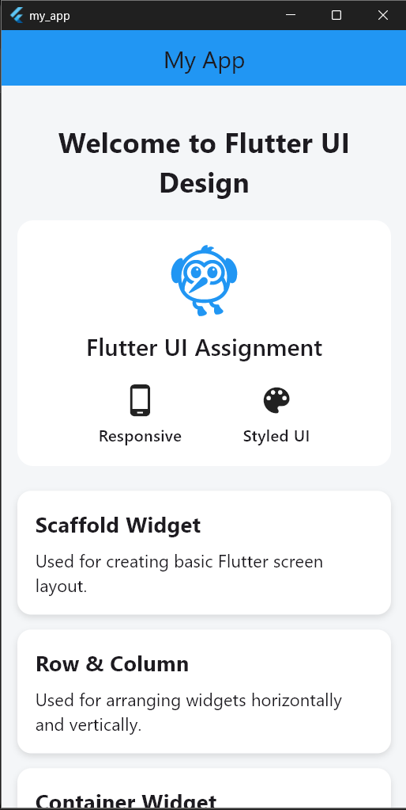
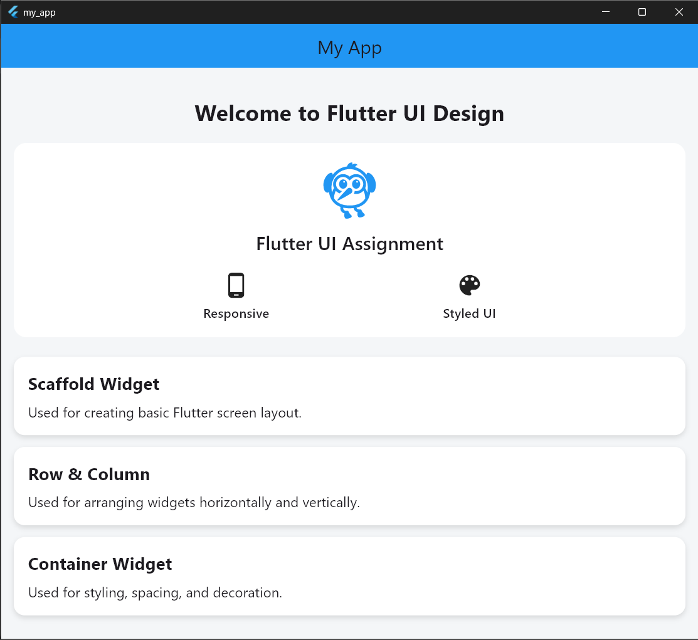

# assignment 4 Output

# Assignment 5 Output

---

## Desktop UI

<table>
<tr>
<td>

</td>
</tr>
</table>

---

## Mobile UI

<table>
<tr>
<td>

</td>
</tr>
</table>

---

## Tablet UI

<table>
<tr>
<td>

</td>
</tr>
</table>
